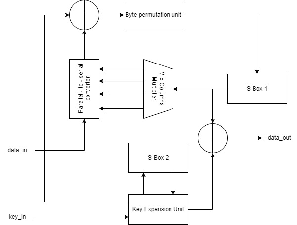

  

# AES-128 Cypher with ECB-mode

> &copy; 2023 Tutor Nelson Salvador, students Shawn Rodrigues and Pablo Aravena, Advanced Center for Electrical and Electronic Engeneering ([AC3E](http://ac3e.usm.cl/)), Universidad Tecnica Federico Santa Maria ([USM](https://usm.cl/)), Valparaiso, Chile

# Description

AES is a symmetric encryption standard handling 128-bit data blocks and key sizes of 128, 192, or 256 bits. It employs rounds of operations including SubBytes, ShiftRows, MixColumns, and AddRoundKey, and has various hardware implementations in ASICs and FPGAs, with design strategies focusing on low power, compactness, and key size flexibility. One approach uses 8-bit data paths and parallel operations to reduce cycle counts. The AES core consists of 
components like byte permutation, MixColumns, S-boxes (duplicated), and key expansion. Overall, AES is versatile and adaptable for different hardware contexts.

The project is based on on ChengluJin's github on "8-bit_datapath_AES", where AES-128 is used in ECB-mode only for the encryption part, with some modifications in order to work with the expected IOs and format for TinyTapeout. In this version of the AES implementation, both inputs (key and data) are entered byte-to-byte on each clock-rise, and null bytes of data are sent to the output until a flag is set internally in order to drive the output pins with the encrypted data.

## How to enable the GitHub actions to build the ASIC files

Please see the instructions for:

- [Enabling GitHub Actions](https://tinytapeout.com/faq/#when-i-commit-my-change-the-gds-action-isnt-running)
- [Enabling GitHub Pages](https://tinytapeout.com/faq/#my-github-action-is-failing-on-the-pages-part)

## How does it work?

When you edit the info.yaml to choose a different ID, the [GitHub Action](.github/workflows/gds.yaml) will fetch the digital netlist of your design from Wokwi.

After that, the action uses the open source ASIC tool called [OpenLane](https://www.zerotoasiccourse.com/terminology/openlane/) to build the files needed to fabricate an ASIC.

## Resources

- [FAQ](https://tinytapeout.com/faq/)
- [Digital design lessons](https://tinytapeout.com/digital_design/)
- [Learn how semiconductors work](https://tinytapeout.com/siliwiz/)
- [Join the community](https://discord.gg/rPK2nSjxy8)

## What next?

- Submit your design to the next shuttle [on the website](https://tinytapeout.com/#submit-your-design), the closing date is 8th September.
- Share your GDS on Twitter, tag it [#tinytapeout](https://twitter.com/hashtag/tinytapeout?src=hashtag_click) and [link me](https://twitter.com/matthewvenn)!
